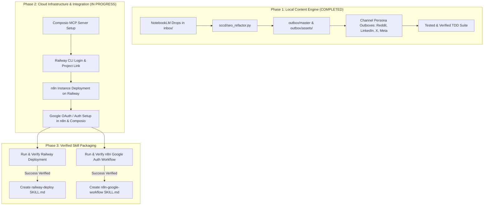

# Project Ideation & System Expansion Roadmap

This document outlines the architecture, setup requirements, and upcoming milestones for the **One-Shot Content & Workflow Engine**.

---

## 🔒 Master Skill Rule

> **CRITICAL RULE:** A workflow is ONLY packaged into a `SKILL.md` AFTER it has been executed and empirically verified as a 100% success. Premature or unverified skills are strictly forbidden.

---

## 🗺️ System Roadmap & Setup Phases

---

## 📑 Detailed Task Breakdown

### Task 1: Composio MCP Configuration
- **Status:** Configured in `.agents/mcp_config.json` via `@composio/mcp@latest`.
- **Target:** Connect Composio tools to Reddit, LinkedIn, X, and Meta using your `COMPOSIO_API_KEY`.
- **Skill Rule:** Create `composio-distribution/SKILL.md` ONLY after live post test verification.

### Task 2: Railway Login & Deployment
- **Status:** Railway CLI v5.27.1 installed.
- **Action Plan:**
  1. Authenticate Railway CLI (`railway login`).
  2. Create/Link Railway project (`railway init` / `railway link`).
  3. Deploy n8n docker instance on Railway.

### Task 3: n8n Instance & Google OAuth Setup
- **Action Plan:**
  1. Configure `N8N_API_URL` and `N8N_API_KEY` once Railway deployment is live.
  2. Authenticate Google OAuth inside n8n for Gmail, Drive, Docs, and Calendar nodes.
  3. Test end-to-end n8n workflow execution.
  4. **Create `n8n-workflow-engine/SKILL.md` ONLY after successful execution.**

---

## 🎯 Verification Criteria
- Every setup step must produce concrete, empirical evidence (CLI output, 200 OK HTTP response, or verified deployment URL).
- `SKILL.md` files are authored strictly post-verification.
